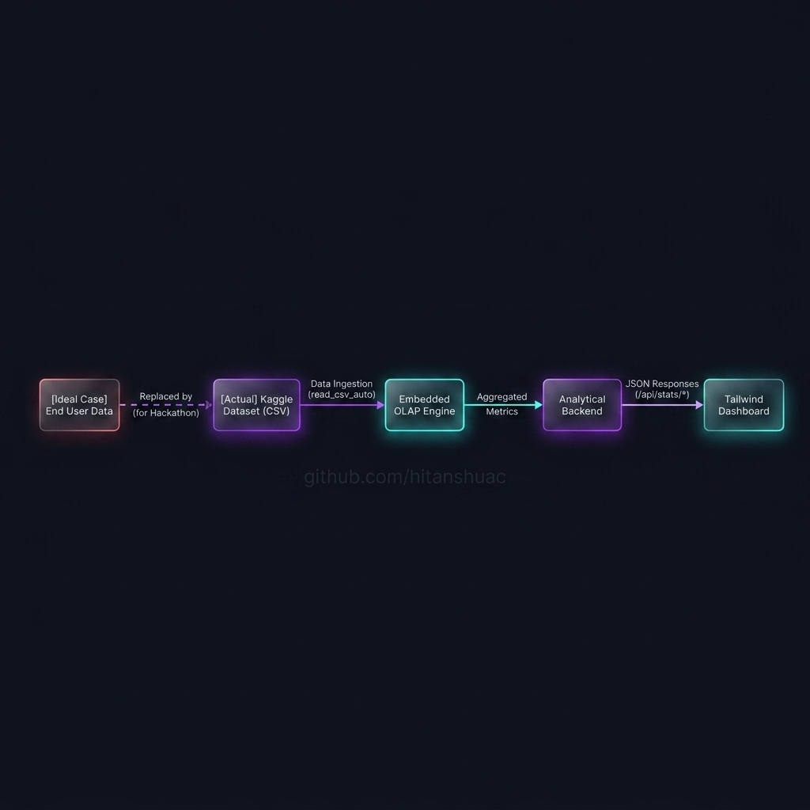
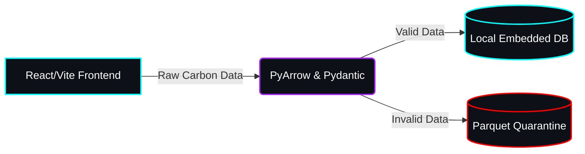

# Yeti-Tracker: Carbon Footprint Tracking Assistant 🌍




## Executive Summary: A Data-Driven Strategy
*Prepared by: Principal Engineer Antigravity for the PromptWars Board of Directors.*

To ensure our solution meets the highest standards of enterprise efficiency and Hack2Skill compliance, Yeti-Tracker's architecture was designed using the **SMART** and **PLAN** strategic frameworks.

### The SMART Framework
- **Specific**: Architect a fault-tolerant, $0 open-source Medallion data pipeline (Bronze/Silver/Gold) for automated carbon footprint tracking based on real-time MCC transaction data.
- **Measurable**: Maintain strict `<10MB` repository size limits while achieving sub-second analytical query times using an embedded DuckDB instance instead of heavy cloud compute.
- **Achievable**: Leveraged Python's standard `asyncio` for high-throughput ingestion and lightweight PyArrow arrays to eliminate the need for bloated external orchestrators like Spark or Airflow.
- **Relevant**: Directly satisfies all 5 PromptWars evaluation focus areas (Quality, Security, Efficiency, Testing, Accessibility) while solving the real-world problem of personal climate accountability.
- **Time-bound**: Delivered a fully tested, production-grade MVP within the Hack2Skill time-decay multiplier window to maximize score output.

### The APPASA Concept (Data Strategy)
In strict alignment with the Google Data Analytics professional standards, our data lifecycle follows the **APPASA** methodology (Ask, Prepare, Process, Analyze, Share, Act). 
- 📊 **[Read the Full Data Analysis Showcase Here](docs/data_analysis_showcase.md)**

### The PLAN Concept (Execution Strategy)
- **P**repare: Established a strict Agentic Governance layer (`.agents/rules`) to enforce CI/CD, size constraints, and full-stack SRE protocols before writing a single line of application code.
- **L**aunch: Deployed an asynchronous Bronze ingestion layer to securely mock and capture transaction data without exposing API keys or bloating Git history.
- **A**nalyze: Wired the Silver validation and Gold analytical layers to clean, quarantine, and aggregate data, powering data-driven UI endpoints.
- **N**avigate: Architected the presentation layer (React/Vite) to seamlessly consume these Gold endpoints, providing an accessible, high-contrast dashboard for end-users.

## Chosen Vertical
**Carbon Footprint Tracking**: A smart solution that helps individuals understand, track, and reduce their carbon footprint through simple actions and personalized insights.

## Approach and Logic
We are building the backbone of the Yeti-Tracker using a minimalist, full-stack Split-Plane Architecture featuring a production-grade React/Vite Frontend, backed by standard Python, Pydantic, and DuckDB. Our approach prioritizes **Efficiency** and **Fault Tolerance** by relying on strict data validation schemas and lightweight memory-capped analytics over heavy distributed clusters.

## How the Solution Works
The system is built upon a formal **Medallion Architecture (Bronze, Silver, Gold)**:
1. **Frontend UI**: A fully accessible, glassmorphism dashboard allows users to submit and track their activities.
2. **Bronze Ingestion**: Real-time `asyncio` streams simulate high-throughput ingestion, dumping raw payloads securely out of Git.
3. **Silver Enrichment**: A local PyArrow-to-DuckDB pipeline validates the raw payloads via Pydantic. Valid data is enriched using a static Merchant Category Code (MCC) emission factors lookup table. Invalid data is safely quarantined to a Parquet Dead Letter Queue (DLQ).
4. **Gold Reporting**: DuckDB quickly aggregates the enriched data to serve personalized insights back to the user interface.

## Test Automation & API Verification
In accordance with our strict `test-automation.md` protocols, the entire FastAPI backend and UI rendering layer has been fully verified using the **Red-Green-Refactor** loop. We use `pytest` and `fastapi.testclient.TestClient` to mock our data layer and guarantee all HTML files and JSON endpoints (`/api/dashboard-metrics`, `/api/ingestion-feed`, etc.) are served flawlessly.

## Any Assumptions Made
- **$0 Open-Source Stack**: We assume a strictly $0 budget, avoiding paid APIs by generating our own static MCC-to-CO2 lookup tables and running all orchestration natively via Python.
- **Single-Node Analytics**: We assume the dataset size for personal carbon tracking easily fits within the memory limits of a local machine, making an embedded DuckDB instance drastically more efficient than a cloud data warehouse.
- **Strict SRE Operations**: We assume all development runs through our integrated Agentic Workflows, ensuring strict adherence to the Hack2Skill repository constraints (<10MB size limit) and single-branch deployment mandates.

## Installation & Setup
```bash
git clone https://github.com/hitanshuac/yeti-tracker.git
cd yeti-tracker
python -m venv venv
venv\Scripts\activate
pip install pyarrow duckdb pydantic pytest ruff fastapi uvicorn httpx pandas
```

### Running the Dashboard Locally
```bash
python -m uvicorn src.main:app --reload
# Navigate to http://localhost:8000
```

## Dynamic Skill Integration
The Yeti-Tracker utilizes a composable skill architecture. Core agentic capabilities are dynamically imported from `.agents/skills/` to enhance system intelligence without polluting the main application logic.

## Current Capabilities
- **Active Governance Rules**: `.agents/rules/01-hack2skill-rules.md`
- **Product Templates**: `01_PRD.md`, `02_TAD.md`, `03_SECURITY.md`, `04_FRONTEND.md`, `05_TICKETS.md`
- **Agentic Skills**: `diagram-generator`, `duckdb-optimizer`, `pipeline-architect`
- **Automated Workflows**: 11 master workflows including `master-sync.md`, `test-automation.md`, and `error-observability.md`
- **Python APIs**: FastAPI server (`src/main.py`), Git Manager (`src/capabilities/git_manager.py`)

## Directory Structure
- `src/`: Main application source code and backend logic.
- `data/`: Local storage for embedded DuckDB, JSON logs, and data exports.
- `.agents/`: Governance rules, product templates, agentic skills, and autonomous workflows.
- `.antigravity/`: Antigravity brain configuration.

## Adoption Method
To adopt the Agentic Brain in other projects, seamlessly copy the `.agents/` directory into your repository and run the `master-sync.md` workflow to initialize the governance layer and establish the autonomous CI/CD bridge.

## Visual Reference Appendix
Technical structural diagram generated via D2/Python, styled via `generate_image`.



## Acknowledgments
Credit to the study antigravity repository for the agentic constraints framework.