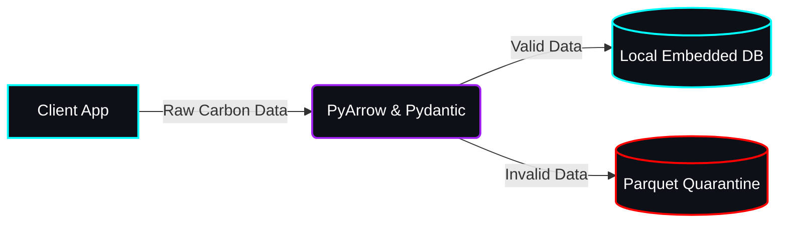

# Yeti-Tracker: Carbon Footprint Tracking Assistant 🌍


## Overview
**Carbon Footprint Tracking**: A smart solution that helps individuals understand, track, and reduce their carbon footprint through simple actions and personalized insights.
We are building the backbone of the Yeti-Tracker using a minimalist, fault-tolerant Split-Plane Architecture centered around standard Python, Pydantic, and DuckDB.

## Dynamic Skill Integration
This repository leverages composable AI skills (`.agents/skills/`) to autonomously enforce SRE principles (e.g., DuckDB WAL, Memory Limits) and generate deterministic architecture diagrams using diagrams-as-code.

## Installation & Setup
```bash
git clone https://github.com/hitanshuac/yeti-tracker.git
cd yeti-tracker
python -m venv venv
venv\Scripts\activate
pip install pyarrow duckdb pydantic pytest ruff
```

## Current Capabilities
- **Rules**: Core Constraints (10MB Size Limit)
- **Python APIs**: `CarbonActivity` (Pydantic), PyArrow to DuckDB pipeline (`duckdb_ingest.py`), Parquet Dead Letter Queue (`processor.py`), Git Manager (`git_manager.py`).
- **Product Templates**: PRD, TAD, Security, Frontend, Tickets.
- **Skills**: Diagram Generator, DuckDB Optimizer, Pipeline Architect.
- **Workflows**: Generate Product Docs, Test Automation, Update Docs, Generate Diagrams, Publish Showcase, Semantic Release, Error Observability, Master Sync, Secure Checkpoint, Git Sync.

## Directory Structure
- `src/`: Python source code (models, ingestion pipelines, capabilities).
- `data/`: Git-ignored storage for `yeti.duckdb` and Parquet files.
- `.agents/`: Agentic workflows, skills, rules, and templates.
- `tests/`: Pytest automation suite.
- `docs/`: Product documents and diagram assets.

## Adoption Method
To inject this Agentic Brain into another project, copy the `.agents/` directory and configure your `git_manager.py` checkpoint workflows.

## Visual Reference Appendix
Technical structural diagram generated via D2/Python, styled via `generate_image`.



## Acknowledgments
Credit to the study antigravity repository for the agentic constraints framework.