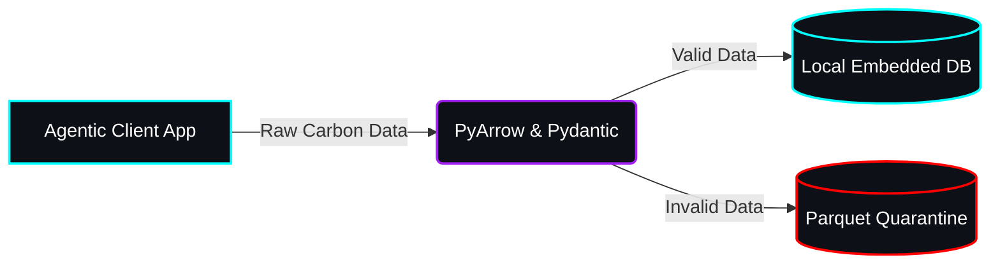

# Yeti-Tracker: Carbon Footprint Tracking Assistant 🌍


## Chosen Vertical
**Carbon Footprint Tracking**: A smart solution that helps individuals understand, track, and reduce their carbon footprint through simple actions and personalized insights.

## Approach and Logic
We are building the backbone of the Yeti-Tracker using a minimalist, fault-tolerant Split-Plane Architecture centered around standard Python, Pydantic, and DuckDB. Our approach prioritizes **Efficiency** and **Fault Tolerance** by relying on strict data validation schemas and lightweight memory-capped analytics over heavy distributed clusters.

## How the Solution Works
The system is built upon a formal **Medallion Architecture (Bronze, Silver, Gold)**:
1. **Agentic UI**: A smart, CLI-based terminal interaction model.
2. **Bronze Ingestion**: Real-time `asyncio` streams simulate high-throughput ingestion, dumping raw payloads securely out of Git.
3. **Silver Enrichment**: A local PyArrow-to-DuckDB pipeline validates the raw payloads via Pydantic. Valid data is enriched using a static Merchant Category Code (MCC) emission factors lookup table. Invalid data is safely quarantined to a Parquet Dead Letter Queue (DLQ).
4. **Gold Reporting**: DuckDB quickly aggregates the enriched data to serve personalized insights back to the user interface.

## Any Assumptions Made
- **$0 Open-Source Stack**: We assume a strictly $0 budget, avoiding paid APIs by generating our own static MCC-to-CO2 lookup tables and running all orchestration natively via Python.
- **Single-Node Analytics**: We assume the dataset size for personal carbon tracking easily fits within the memory limits of a local machine, making an embedded DuckDB instance drastically more efficient than a cloud data warehouse.
- **Strict SRE Operations**: We assume all development runs through our integrated Agentic Workflows, ensuring strict adherence to the Hack2Skill repository constraints (<10MB size limit) and single-branch deployment mandates.

## Installation & Setup
```bash
git clone https://github.com/hitanshuac/yeti-tracker.git
cd yeti-tracker
python -m venv venv
venv\Scripts\activate
pip install pyarrow duckdb pydantic pytest ruff
```

## Visual Reference Appendix
Technical structural diagram generated via D2/Python, styled via `generate_image`.



## Acknowledgments
Credit to the study antigravity repository for the agentic constraints framework.