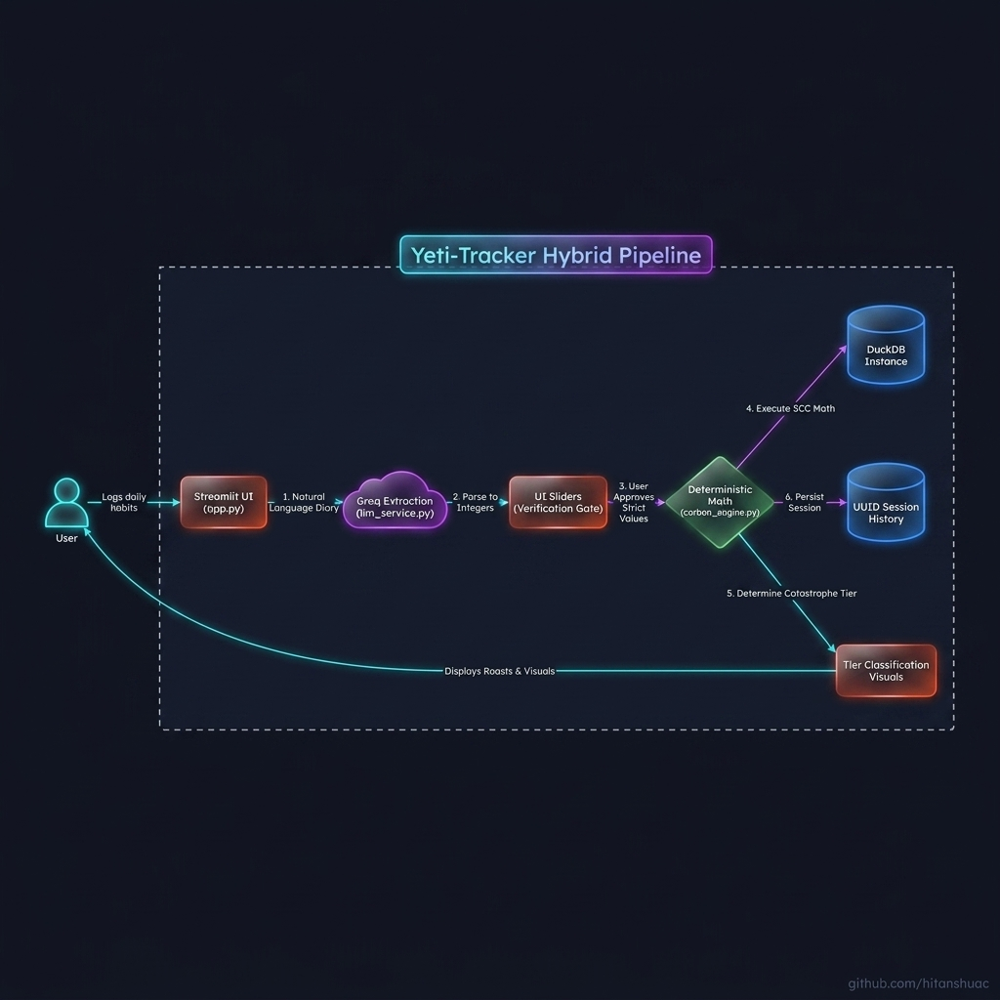
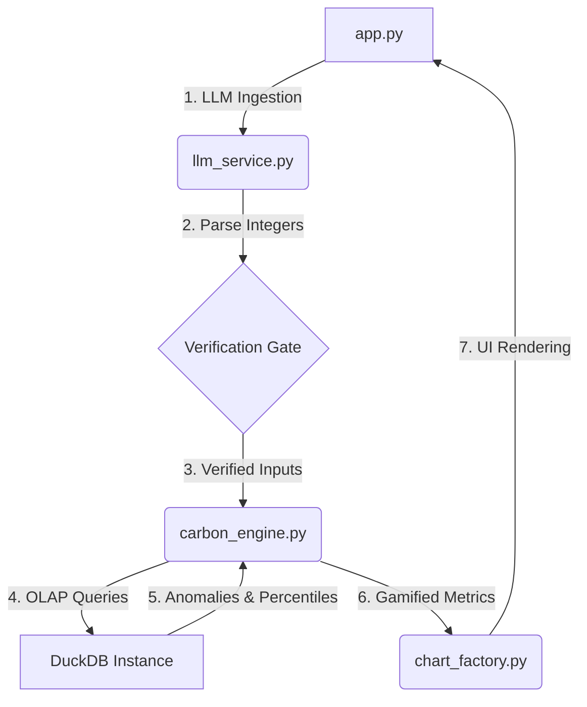

# Yeti-Tracker: Personal Carbon Footprint Gamification 🌍

**Vertical/Persona:** "Carbon Footprint Awareness Platform" (Hack2Skill Challenge 3)

### 🏆 Hack2Skill Generative AI Hackathon
This project was built for the **Hack2Skill Generative AI Hackathon**.
- **AI Evaluation Score:** 93.3 / 100
- **Final Leaderboard Rank:** 990 / 33,000 participants
- **Score Breakdown:** Efficiency (100), Security (98), Testing (96), Accessibility (95), Alignment (93), Code Quality (86).


## Overview: Behavioral Variation & Anomaly Tracker

Yeti-Tracker is an AI-powered personal observability platform that pivots away from a generic carbon calculator into a dynamic variation tracker. It monitors daily behavioral habits against a mathematically rigorous deterministic floor (World Bank 2,500 kg baseline) and uses SRE-grade percentile logic to flag anomalies.

To solve the inherent conflict between **AI Hallucinations** (non-determinism) and **Scientific Data Integrity** (idempotent mathematics), Yeti-Tracker implements the **Hybrid Pipeline** (Split-Plane Architecture):



1. **The Confessional (LLM Ingestion)**: Users paste a messy, natural language diary entry.
2. **The Out-of-Bounds Catcher**: The LLM isolates unstructured edge-cases (e.g., eating beef, flying helicopters) into an `untracked_activities` array, preventing them from contaminating the mathematical pipeline while exposing them to the user via UI transparency warnings.
3. **The Verification Gate**: The LLM *only* populates explicit UI sliders (including granular modes like bus and train/metro vs cars). The human verifies the extracted integers, guaranteeing the AI cannot break the downstream math.
4. **Deterministic Math Engine**: A local DuckDB instance (protected by a strict `PRAGMA table_info` self-healing schema migrator) takes the verified seed and deterministically calculates the carbon cost and localized financial impact in **INR (₹)**. It isolates basic survival electricity (2,500 kg baseline) from discretionary usage (Sleep/Daytime AC) using gamified metrics.
5. **Scientific Transparency Dashboard**: The UI directly displays the `carbon_factors.csv` rendering, exposing the exact Emission Agencies (CSTEP, CEA) and metrics used for math, eliminating black-box hallucination.
6. **Machine Learning Anomaly Detection**: The DuckDB engine natively calculates the 90th percentile (`PERCENTILE_CONT(0.9)`) over your historical sessions to flag statistical behavioral spikes.
7. **The Catastrophe Tiers Gamification**: If the footprint crosses certain thresholds, users are placed into Catastrophe Categories (e.g., Category 3) and presented with aggressive visual and textual roasting to gamify footprint reduction.
8. **Continuous Confession Loop**: A recursive input pattern where user responses are appended to their "confessional," enabling an addictive feedback loop that tracks history per-session via secure UUIDs.
9. **The Smart Advisor**: Generates hyper-specific "Instant Gratification" alternatives (Convenience vs. Maximum Impact) to guarantee a 20% reduction, ensuring advice is contextual and never redundant.

**UX Integrity**: The entire ingestion pipeline is governed by Streamlit caching (`@st.cache_data`) and state management to completely eliminate UI reset glitches during button interactions.

## Dynamic Skill Integration
The Yeti-Tracker's intelligence is powered by composable skill imports located in `.agents/skills/`. This allows the agent to dynamically load capabilities such as pipeline architecture, diagram generation, or running an LLM-Council debate without cluttering the core application logic.

## Installation & Setup

```bash
git clone https://github.com/hitanshuac/yeti-tracker.git
cd yeti-tracker
python -m venv venv
venv\Scripts\activate
pip install -r requirements.txt
```

### Running the Dashboard Locally
We strictly follow 12-Factor App methodology for secrets. We have provided a template for you.
1. Open `.secrets/.env` and add your **GROQ_API_KEY**.
2. Run the convenience batch script to automatically start the Dashboard.

```bash
run_server.bat
# Automatically opens in your browser!
```

## Current Capabilities

Yeti-Tracker enforces strict engineering standards via the `.agents` framework. This is a dynamic inventory based on the current stable checkpoint:

- **Rules (24 Active)**: Includes the Tier 0 `defensive-programming.md` and `data-validation.md` (which enforce schema-first data contracts and verified dataset mandates), plus `code-quality-standards.md`, `sre-sop.md`, and `12-factor-rules.md`.
- **Python APIs**: Built with Streamlit, Plotly, DuckDB, and Pydantic with idempotent I/O and strict error observability.
- **Product Templates (5 Active)**: Fully populated `01_PRD.md`, `02_TAD.md`, `03_SECURITY.md`, `04_FRONTEND.md`, and `05_TICKETS.md`.
- **Skills (5 Active)**: Diagram Generator, DuckDB Optimizer, LLM-Council, Pipeline Architect, Universal Ingestion.
- **Workflows (25 Active)**: Including `deploy-streamlit-production.md`, `master-sync.md`, `test-automation.md`, and `update-docs.md`.
- **Architecture Decision Records (6 Active)**: Covering schema migration, data validation, and master sync checkpoints.
- **Demo Personas (7 Active)**: Including "The Last-Mile Addict" and "The Home Chef" which trigger the Out-of-Bounds Catcher for unverified lifestyle activities.

## Directory Structure

- `app.py`: Thin Streamlit UI Orchestrator (~313 lines).
- `src/`: Core service modules orchestrating business logic:
  - `state_manager.py`: Pydantic AppState management.
  - `carbon_engine.py`: Deterministic DuckDB math & percentile anomaly detection.
  - `llm/`: Decomposed Groq orchestration (client, models, parsers, prompts).
  - `rag_service.py`: Context retrieval.
  - `chart_factory.py`: Plotly visualizations.
  - `history.py`: DuckDB connection pooling and telemetry.
  - `observability.py`: Centralized error logging and tracing.
  - `security.py`: Input sanitization and CWE-74 mitigation.
  - `ui/`: Decoupled view layer (`components.py` and `dashboard.py`).
- `tests/`: Automated SRE test suite (66 tests with 100% pass rate).
- `scripts/`: Internal tools, including `diagram_extractor.py` (AST codebase mapping).
- `data/`: Local storage for `yeti.duckdb`, CSV baselines, and `error_logs.json`.
- `.agents/`: Governance rules, product templates, agentic skills, and autonomous workflows.

## Adoption Method
To inject the Agentic Brain into other projects, simply copy the `.agents/` directory to the root of your new project and invoke the `bootstrap.md` or `master-sync.md` workflows.

## Visual Reference Appendix
<p align="center">
  
</p>
<p align="center">
    </p>


### Code Flow Diagram

